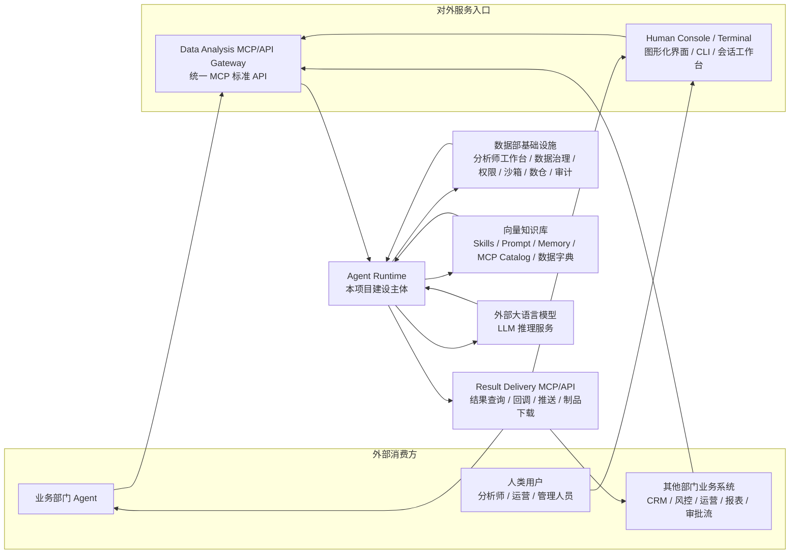
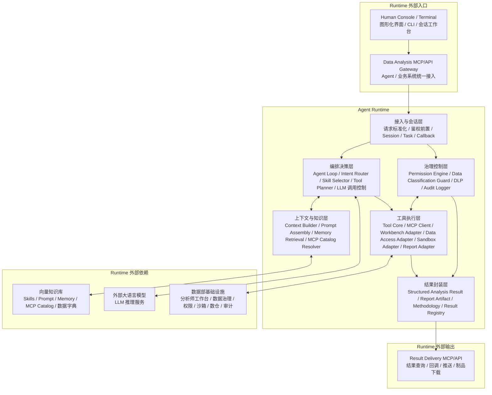
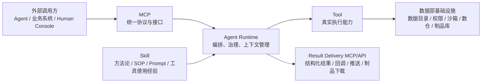

**银行数据分析 Agent 总体架构规划**

**一、总体边界与服务入口**



**Agent Runtime 是建设主体**

Agent Runtime 负责把“智能体能力”组织起来，但不直接替代银行已有系统。它的核心范围包括：

- 对外暴露统一 `Data Analysis MCP/API Gateway`，供其他业务部门 Agent、其他部门业务系统、Human Console / Terminal 调用数据分析能力。
- 建设对人服务入口 `Human Console / Terminal`，提供类似 Codex 的图形化会话界面、终端式交互、任务追踪、结果预览和制品下载能力。
- 提供 `Result Delivery MCP/API`，支持结果查询、异步回调、结果推送、制品下载，让业务系统可以按 MCP 标准直接消费分析输出。
- 内部管理 Agent Loop、Tool Core、MCP Client/Server、Context Builder、Session Manager。
- 执行权限校验、审计、脱敏、上下文裁剪、结果封装。
- 调用分析师工作台、数据沙箱、数据治理、数据目录、权限系统等数据部基础设施。
- 调用大模型完成理解、规划、解释、报告生成。

**Agent Runtime 内部架构**

Agent Runtime 内部可以按“接入与会话、编排决策、上下文与知识、治理控制、工具执行、结果封装”六层组织。它对外通过 MCP 标准提供服务，对内通过受控工具和适配器调用银行既有能力。



内部层次说明：

- 接入与会话层：接收 `Data Analysis MCP/API Gateway` 的标准化请求，统一处理调用方身份、请求 schema、会话、任务、回调地址和结果接收方式。`Human Console / Terminal` 不直接进入 Runtime 内核，而是作为 MCP Client 先调用统一 Gateway。
- 编排决策层：负责 Agent Loop、意图识别、能力选择、工具规划和 LLM 调用控制。LLM 的输出只作为计划、解释或生成建议，不能绕过 Runtime 直接执行。
- 上下文与知识层：根据请求场景、权限范围和任务状态，从向量知识库加载 Skills、Prompt、Memory、MCP Catalog、数据字典和指标口径，形成可审计的 `context_snapshot`。
- 治理控制层：贯穿请求、工具调用和结果输出全过程，负责权限判断、数据分级分类、脱敏、审计、风险拦截和人工确认触发。
- 工具执行层：通过 Tool Core 和 MCP Client 调用已登记、已授权的企业能力，包括分析师工作台、数据目录、数据沙箱、数仓查询、Notebook 执行和报告制品生成。
- 结果封装层：把执行结果统一封装为结构化分析结果、报告制品、方法说明、假设限制、敏感级别、审计 ID，并登记到 Result Registry。

Runtime 与外部系统的连接关系：

- 与外部消费方：业务部门 Agent、其他部门业务系统只通过 `Data Analysis MCP/API Gateway` 提交请求；人类用户通过 `Human Console / Terminal` 使用服务，但底层仍走 MCP 标准 API。
- 与向量知识库：Runtime 只读取已发布、可审计、可版本化的知识内容；向量召回只提供上下文候选，不决定权限和最终结论。
- 与数据部基础设施：Runtime 通过 Tool Core 和 MCP Client 受控调用，不重建分析师工作台、数据治理、权限、沙箱、数仓和审计系统。
- 与外部大语言模型：Runtime 向 LLM 提供裁剪后的上下文和安全约束，LLM 返回规划、解释或报告草稿；任何工具调用和结果输出都必须回到 Runtime 校验。
- 与结果接收方：Runtime 不直接执行业务动作，而是通过 `Result Delivery MCP/API` 把结果交付给 Agent、业务系统或 Human Console / Terminal，由接收方自行完成业务闭环。

**Human Console / Terminal 是对人服务层**

除了 MCP/API，系统需要提供一个面向人的交互入口，形态可以是图形化界面、终端或两者并存。它不绕过 Agent Runtime，也不直接访问数据底座，而是作为 MCP Client 调用统一 `Data Analysis MCP/API Gateway`。

建议能力：

- 会话式分析：支持自然语言提问、多轮澄清、上下文恢复、任务继续执行。
- 终端式操作：支持高级用户用命令、参数和脚本化方式提交分析任务。
- 任务工作台：展示分析请求、执行状态、审批状态、运行日志、错误信息。
- 结果预览：展示结构化结果、图表、报告、Notebook 摘要、可下载制品。
- 人工确认：承接高风险动作、敏感数据访问、结果外发前的确认和审批。
- 审计可见：对用户展示本次分析使用的数据范围、方法、假设、限制和审计 ID。

原则：Human Console / Terminal 只是对人的产品界面，所有能力调用仍必须经过 MCP 标准 API、权限引擎、审计和脱敏链路。

**数据部基础设施在 Runtime 外部**

这些系统不是 Agent Runtime 重建对象，而是被 Agent Runtime 受控调用：

- 分析师工作台：数据申请、数据拉取、沙箱、查数、建模、生产复用流程。
- 数据治理平台：数据目录、数据字典、血缘、分级分类、质量规则。
- 权限/IAM：员工身份、部门、角色、授权范围、审批状态。
- 数据底座：数仓、湖仓、宽表、指标平台、沙箱计算资源。
- 审计/日志：访问记录、调用链、审批链、结果使用记录。
- 制品库：报告、图表、Notebook 摘要、结构化分析结果。

原则：业务部门 Agent 不直连数据底座；所有跨部门用数和分析能力调用都经过 Agent Runtime 的统一数据智能控制面。

**外部接入方不只有 Agent**

对外接入需要把“业务部门 Agent”和“其他部门业务系统”都作为一等调用方。业务系统可以直接通过 MCP 标准 API 创建分析任务、查询状态、订阅结果、拉取制品，也可以把分析结果回填到自己的业务流程中。

接入方类型：

- 业务部门 Agent：以智能体方式提交问题、接收结构化结果，再由自身完成业务闭环。
- 其他部门业务系统：以系统间接口方式提交标准化请求，例如客户经营、风险监测、运营分析、报表平台、审批流系统。
- Human Console / Terminal：以人的交互界面方式提交请求，本质上仍是 MCP Client。

输入方式：

- 同步请求：适合轻量查询、能力枚举、结果解释。
- 异步任务：适合长耗时分析、沙箱计算、Notebook 执行、报告生成。
- 事件触发：业务系统通过 MCP 标准事件或回调触发分析任务，例如批量名单分析、指标异常归因。

输出方式：

- 查询式输出：调用方通过 `get_analysis_result`、`list_result_artifacts` 主动拉取。
- 回调式输出：Runtime 在任务完成、失败、需要审批时调用业务系统注册的 MCP 回调端点。
- 推送式输出：Runtime 将结构化结果、报告制品、审计 ID 推送到业务系统指定的结果接收接口。
- 人机输出：Human Console / Terminal 展示结果预览、方法说明、可下载制品和后续追问入口。

原则：无论输入来自 Agent、人还是业务系统，协议层都统一使用 MCP 标准 API；无论输出给 Agent、人还是业务系统，结果都必须经过统一的权限、脱敏、审计和结果封装。

**向量知识库在 Runtime 外部**

它存放可配置、可版本化、可审批发布的文本和知识内容。向量索引用于语义召回，但不应成为唯一事实来源。

可放入：

- Skills：分析流程、方法论、SOP、报告写法。
- Prompt Templates：系统提示词、角色提示词、报告模板。
- Memory：项目记忆、历史结论、用户偏好、经验沉淀。
- MCP Catalog：可用 MCP/API 能力目录、owner、版本、可见范围。
- Tool Metadata：工具说明、风险提示、使用样例。
- 数据知识：指标口径、数据字典、字段解释、治理规则说明。
- 报告模板：经营分析、风险分析、监管分析等通用报告结构。

运行时加载规则：

```text
精确加载：
- 基础 Prompt
- 安全规则
- Tool/MCP Catalog
- 已发布 Skill 版本

语义召回：
- Memory
- 数据字典
- 指标口径
- 历史分析经验
- 场景化 Skill 候选
```

每次会话必须记录 `context_snapshot`，包括 prompt 版本、skill 版本、召回文档、MCP catalog 版本、权限策略版本。

**大语言模型在 Runtime 外部**

LLM 只负责推理、规划、生成、解释，不承担权限和执行边界。

LLM 输入来自 Agent Runtime 组装后的上下文：

- 用户问题
- 已授权的数据摘要
- 相关 Skill
- 相关数据字典/指标口径
- 可用 Tool/MCP 列表
- 安全约束
- 历史上下文

LLM 输出不能直接执行，必须回到 Agent Runtime，由 Runtime 判断是否允许调用 Tool、是否需要审批、是否需要脱敏、是否能返回结果。

**二、跨框架主流程**

```text
1. 业务部门 Agent、其他部门业务系统或分析师提交分析请求
   - Agent / 业务系统通过 Data Analysis MCP/API Gateway 接入
   - 人类用户通过 Human Console / Terminal 接入，底层仍调用 MCP/API
2. Agent Runtime 鉴权，识别调用方类型、身份、用途、数据范围、结果接收方式
3. Runtime 查询向量知识库，加载 Skill / Prompt / 数据字典 / Memory
4. Runtime 调用数据部基础设施：
   - 查数据目录
   - 校验权限
   - 发起数据申请
   - 拉取到沙箱
   - 执行 SQL / Python / Notebook
5. Runtime 调用 LLM 进行规划、解释、报告生成
6. Runtime 对结果做脱敏、审计、结构化封装
7. Runtime 生成分析结果包、报告制品、方法说明、审计 ID
8. Runtime 按调用方约定输出结果：
   - Agent 主动查询或接收回调
   - 业务系统通过 MCP 标准 API 查询、回调或接收推送
   - Human Console / Terminal 展示结果预览、制品下载和后续追问
9. 业务部门 Agent 或业务系统自行决定如何消费结果，不由数据分析 Agent 执行业务动作
```

**三、对外 Data Analysis MCP/API 设计**

对外接口不只服务业务部门 Agent，也服务其他部门业务系统和 Human Console / Terminal。协议层统一使用 MCP 标准 API，不为不同调用方拆出多套私有接口。

接口只暴露数据分析能力、任务管理能力和结果交付能力，不暴露业务动作。

通用能力：

- `list_analysis_capabilities`
- `describe_analysis_capability`
- `validate_analysis_request`
- `create_analysis_request`
- `get_analysis_status`
- `get_analysis_result`
- `list_result_artifacts`
- `get_report_artifact`
- `explain_analysis_method`
- `request_result_clarification`

会话与对人服务能力：

- `create_analysis_session`
- `resume_analysis_session`
- `append_session_message`
- `list_session_tasks`
- `get_session_transcript`
- `submit_human_approval`

业务系统接入能力：

- `register_result_callback`
- `update_result_callback`
- `subscribe_analysis_event`
- `acknowledge_result_delivery`
- `get_delivery_status`

结果输出标准：

- 结构化结果：JSON schema，包含指标、维度、口径、结论、置信说明。
- 报告制品：Markdown / HTML / PDF / PPT / Notebook 摘要等可登记制品。
- 解释信息：方法、假设、限制、数据范围、时间范围、敏感级别。
- 治理信息：请求 ID、任务 ID、审计 ID、权限策略版本、脱敏策略版本。
- 交付信息：查询地址、回调状态、推送状态、接收方确认状态。

不暴露：

- 反洗钱案件创建
- 监管报送提交
- 业务审批
- 推送业务前端
- 直接查询生产明细库

说明：业务系统可以接收分析结果，但是否创建案件、触发审批、更新客户状态、推送业务前端，仍由业务系统自己的规则和流程决定。

**四、关键设计原则**

- Agent Runtime 是统一数据智能控制面。
- 业务 Agent、其他部门业务系统、Human Console / Terminal 都不直连数据底座。
- 对外服务同时覆盖 Agent、业务系统和人，但协议层统一收敛到 MCP 标准 API。
- Human Console / Terminal 是面向人的 MCP Client，不绕过权限、审计、脱敏和结果封装。
- 业务系统可以直接通过 MCP 标准 API 接入，也可以通过 MCP 标准 API 接收结果输出。
- Skills、Prompt、Memory、Catalog 可以数据库化、向量化、版本化。
- Tool Core、权限、审计、脱敏、MCP 协议、沙箱执行必须代码化和投产化。
- 向量库负责召回知识，不负责决定权限。
- LLM 负责推理，不负责真实执行和合规判断。
- 所有分析结果都必须带方法、假设、限制、数据范围、敏感级别和审计 ID。
- 其他业务部门只消费分析结果，业务闭环由他们自己的 Agent 和业务系统完成。

**五、Tool、MCP、Skill 的定义与工作机制**

Tool、MCP、Skill 是 Agent Runtime 的三类核心构件，但它们不是同一种东西。

一句话区分：

- Tool 是“可被调用的真实能力”，负责执行具体动作。
- MCP 是“能力暴露和调用的标准协议”，负责让不同系统按统一方式沟通。
- Skill 是“可复用的方法和经验”，负责指导 Agent 如何理解问题、规划步骤、选择工具和组织结果。

三者关系：



**Tool 的定义、功能和架构含义**

Tool 是 Agent Runtime 可以调用的最小执行能力单元。它不是某个代码文件名称，而是一种被标准化封装、可鉴权、可审计、可观测的能力。

Tool 可以封装：

- 查询数据目录、数据字典、指标口径。
- 校验用户、部门、用途和数据范围权限。
- 发起数据申请、审批流或沙箱资源申请。
- 在授权沙箱中执行 SQL、Python、Notebook 或模型计算。
- 生成图表、报告、Notebook 摘要和结构化分析结果。
- 登记结果制品、写入审计日志、返回执行状态。

在本架构中，Tool 主要位于 Agent Runtime 的工具执行层，由 `Tool Core` 统一管理，并通过不同 Adapter 受控调用数据部基础设施。Tool 不直接暴露给外部 Agent 或业务系统，外部调用方看到的是 `Data Analysis MCP/API Gateway` 暴露的分析能力，而不是底层工具清单。

Tool 的基本元数据应包括：

- 工具名称、能力说明、owner、版本、可见范围。
- 输入 schema、输出 schema、错误码、超时和重试策略。
- 权限要求、数据敏感级别、是否需要审批。
- 风险提示、适用场景、禁止场景、审计字段。
- 是否支持同步调用、异步任务、流式进度或制品输出。

Tool 的工作机制：

```text
1. 编排决策层根据用户意图和 Skill 建议生成工具调用计划
2. 治理控制层检查调用方身份、用途、权限、数据范围和风险等级
3. Tool Core 根据 MCP Catalog / Tool Metadata 找到可用工具和版本
4. Tool Core 通过 MCP Client 或内部 Adapter 调用对应企业能力
5. 工具执行结果以结构化格式返回 Runtime
6. Runtime 记录审计日志、处理脱敏和错误，再交给结果封装层
```

Tool 的对外沟通方式：

- 对外部消费方：不建议直接暴露底层 Tool，只暴露更稳定的分析任务能力，例如 `create_analysis_request`、`get_analysis_result`。
- 对数据部基础设施：通过 Tool Adapter 或 MCP Client 调用，调用前必须经过权限、数据分级和审计控制。
- 对 Agent Runtime 内部：Tool 只接受 Runtime 发起的受控调用，不接受 LLM 或外部系统绕过 Runtime 直接调用。

**MCP 的定义、功能和架构含义**

MCP 是本架构中统一的能力开放和系统间通信标准。它定义外部调用方如何发现能力、提交请求、查询状态、接收结果、处理回调，也定义 Runtime 如何以标准方式调用外部能力。

MCP 主要解决四类问题：

- 能力发现：调用方知道当前有哪些分析能力、输入要求和输出格式。
- 请求标准化：不同 Agent、业务系统和 Human Console 使用同一套 schema 提交请求。
- 调用可治理：每次调用都能携带身份、用途、权限上下文、任务 ID 和审计 ID。
- 结果可交付：结果可以被查询、回调、推送和确认接收。

在本架构中，MCP 有三种角色：

- 对外 MCP Server：`Data Analysis MCP/API Gateway` 对外暴露数据分析能力，服务业务部门 Agent、其他部门业务系统和 Human Console / Terminal。
- 结果 MCP Server：`Result Delivery MCP/API` 对外提供结果查询、回调、推送、制品下载和交付确认。
- 对内 MCP Client：Agent Runtime 调用已登记的企业能力、外部工具服务或其他 MCP Server，统一纳入 Tool Core、权限和审计链路。

MCP 的工作机制：

```text
1. 调用方通过 MCP 能力发现接口获取可用分析能力
2. 调用方按 MCP schema 提交同步请求或异步任务
3. Gateway 将请求标准化后交给 Agent Runtime
4. Runtime 完成鉴权、上下文构建、Skill 加载、工具规划和执行
5. Runtime 将结果封装为标准结果对象和报告制品
6. 调用方通过 MCP 查询结果，或由 Runtime 按 MCP 回调/推送协议交付结果
7. 接收方确认接收，Runtime 记录完整审计链路
```

MCP 的对外沟通方式：

- Agent 接入：Agent 通过 MCP 创建分析请求、查询状态、获取结果，再由自身决定下一步业务动作。
- 业务系统接入：业务系统通过 MCP 提交标准化请求、注册回调、订阅事件、接收结构化结果。
- Human Console 接入：Human Console / Terminal 本质上是 MCP Client，用图形界面或终端体验包装 MCP 调用。
- 结果交付：Runtime 使用 MCP 标准输出结构化结果、报告制品、审计 ID、交付状态和接收确认。

MCP 不负责替代业务逻辑、权限判断和分析推理。它只规定“怎么沟通”，真正的编排、权限、脱敏、审计和执行控制仍由 Agent Runtime 完成。

**Skill 的定义、功能和架构含义**

Skill 是可复用的分析经验和任务方法。它描述“遇到某类问题应该如何分析、需要哪些上下文、适合调用哪些工具、结果应该如何解释和呈现”。Skill 通常不直接执行真实动作，而是指导 Agent Runtime 做规划和决策。

Skill 可以包含：

- 分析流程：例如经营分析、风险归因、客户分群、指标异常诊断。
- 方法论和 SOP：数据选择、指标解释、统计方法、验证步骤、报告结构。
- Prompt 模板：不同场景下的系统提示词、角色提示词、报告生成提示词。
- 工具使用建议：什么情况下应查询数据目录、申请沙箱、执行 SQL、生成报告。
- 风险和合规规则：哪些问题需要人工确认，哪些数据不能外发，哪些结论必须加限制说明。
- 输出模板：结构化结果字段、图表建议、报告章节、假设和限制写法。

在本架构中，Skill 位于向量知识库中，由 Agent Runtime 的上下文与知识层加载。Skill 是版本化、可审批、可发布的知识资产，不应该散落在单次会话里，也不应该由 LLM 临时自由发挥替代。

Skill 的工作机制：

```text
1. Runtime 根据请求场景、调用方身份、业务用途和数据范围识别候选 Skill
2. 上下文与知识层从向量知识库加载已发布 Skill 版本
3. Context Builder 将 Skill、Prompt、数据字典、指标口径、MCP Catalog 组装为上下文
4. 编排决策层参考 Skill 生成分析步骤和工具调用计划
5. 治理控制层检查 Skill 建议中的工具、数据和输出是否合规
6. 执行完成后，结果封装层按 Skill 要求组织解释、报告结构、假设和限制
7. 本次使用的 Skill 版本写入 context_snapshot 和审计记录
```

Skill 的对外沟通方式：

- 对外部调用方：通常不直接暴露 Skill 全量内容，只暴露可用分析能力、能力说明、输入要求和结果样例。
- 对 Human Console：可以展示较高层级的方法说明，例如“本次使用经营分析 Skill，包含指标拆解、趋势比较、异常归因和限制说明”。
- 对业务系统：以稳定能力名称和结果 schema 沟通，不要求业务系统理解 Skill 内部细节。
- 对治理和审计：必须记录 Skill 名称、版本、加载来源、召回依据和本次影响的工具调用计划。

Skill 不是权限来源，也不是事实来源。权限来自权限/IAM 和治理控制层，事实来自经过授权的数据、数据字典、指标口径和数据部基础设施。Skill 负责把这些材料组织成可执行、可解释、可复用的分析过程。

**三者在一次分析任务中的协同流程**

```text
1. 外部 Agent、业务系统或 Human Console 通过 MCP 提交分析请求
2. Runtime 解析请求，识别调用方、业务用途、数据范围和交付方式
3. Runtime 从向量知识库加载相关 Skill、Prompt、Memory、MCP Catalog
4. Skill 指导 Runtime 形成分析计划和候选 Tool 调用序列
5. 治理控制层对候选 Tool 调用做权限、敏感级别、审批和审计检查
6. Tool Core 调用授权 Tool，受控访问数据部基础设施
7. Runtime 汇总 Tool 返回的数据、日志、图表和制品
8. Runtime 按 Skill 要求生成解释、方法、假设、限制和报告结构
9. Runtime 通过 Result Delivery MCP/API 将结果交付给 Agent、业务系统或 Human Console
```

设计原则：

- 外部调用方通过 MCP 沟通，不直接调用底层 Tool。
- Tool 负责执行，不负责判断是否有权执行。
- Skill 负责指导，不直接绕过 Runtime 执行工具。
- MCP 负责协议，不承载业务闭环。
- Runtime 同时约束 Tool、MCP、Skill，保证权限、审计、脱敏和结果封装一致。
